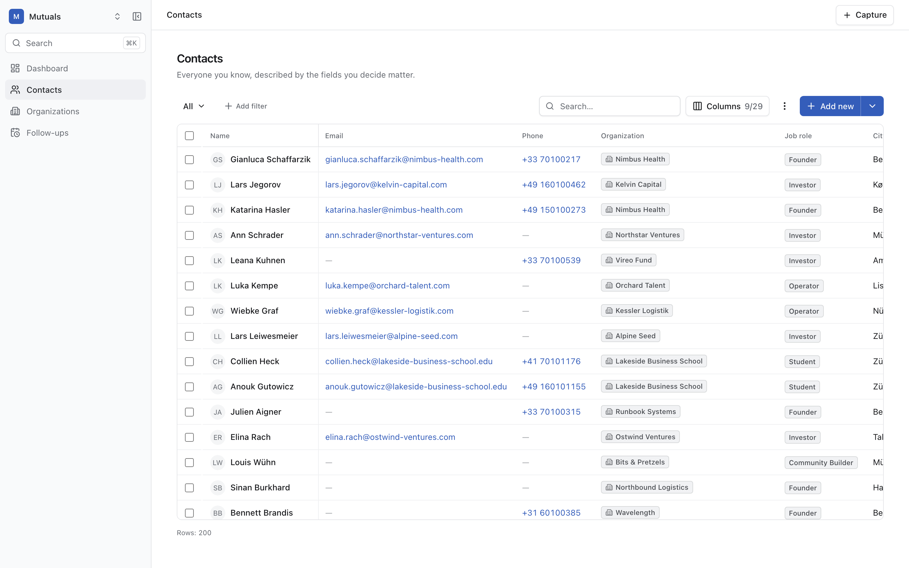
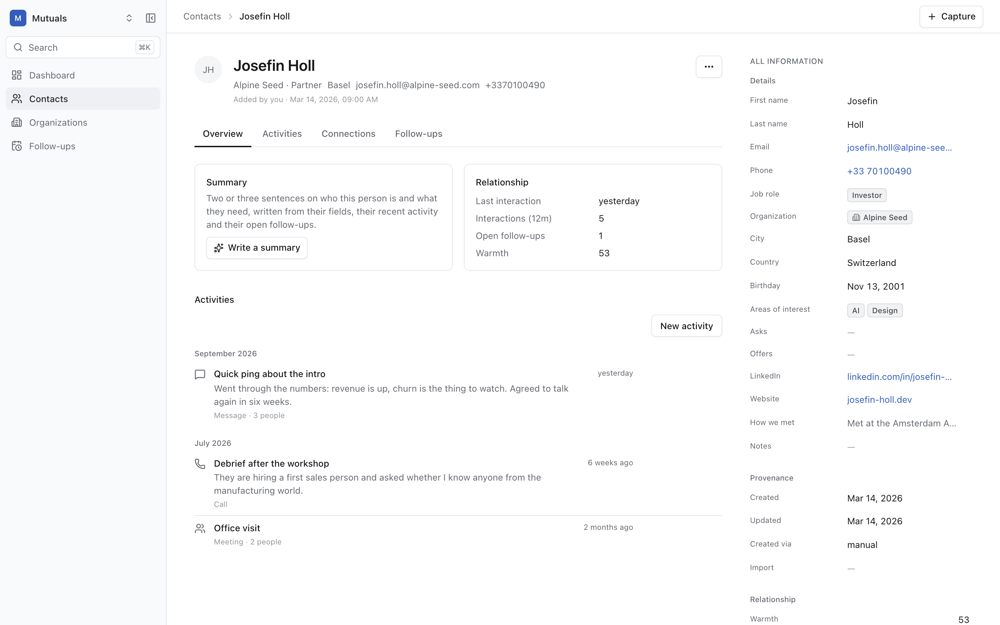
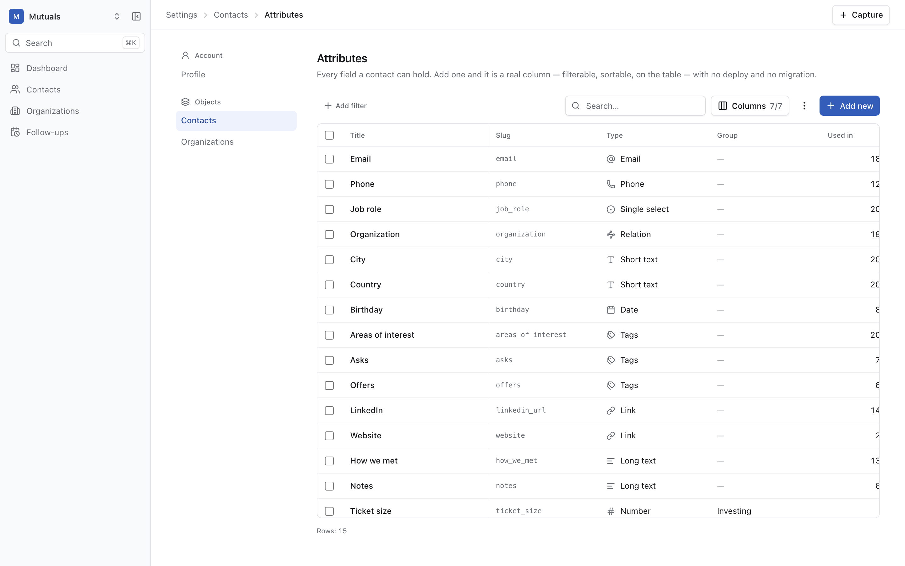
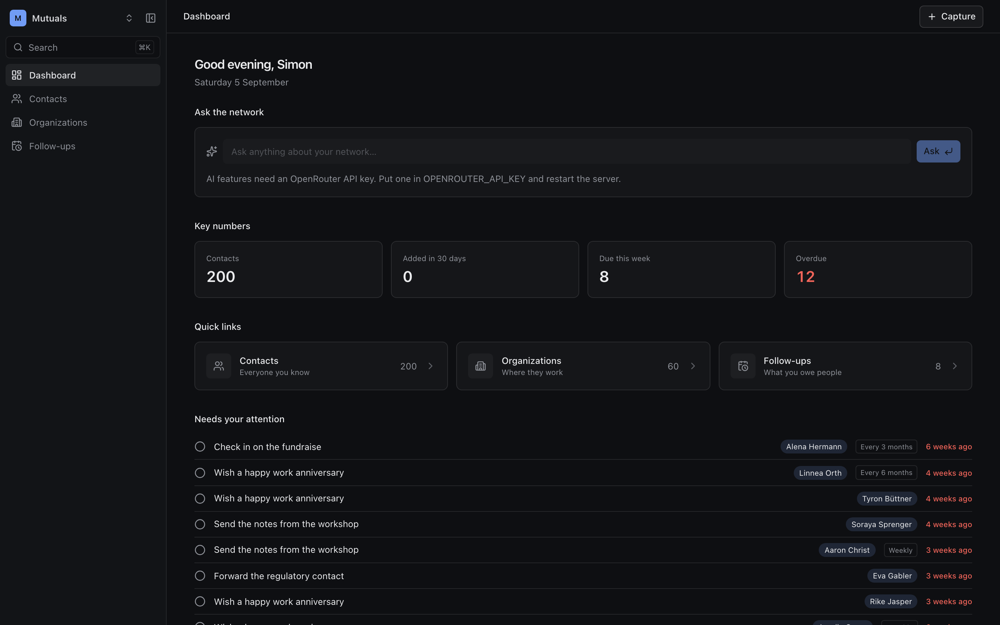

# Mutuals

**Mutuals — the personal people CRM for the agentic era.** · getmutuals.ai

A tool for founders, investors, operators and community builders to keep track of everyone they know — with an agent inside that knows your whole network.

Ask it things like:

> "I just met a health-tech founder in Munich who is raising €600k. Which investors in my network would be a fit?"

## Why another CRM?

Most CRMs are built for sales teams. This one is built for a person and their network.

- **Proactive.** It reminds you to stay in touch with the right people and suggests introductions between people who need each other.
- **Effortless.** After a meeting, type one sentence. The system turns it into a contact, a note and a follow-up.
- **Yours to shape.** Define your own attributes and table views. Import from LinkedIn, Google Contacts or any spreadsheet without duplicates.
- **Agent-ready.** Everything the UI can do, the API can do. An MCP server, a chat bot and a CLI are just more clients.

---

## What it looks like

Invent a field in Settings and it is a real column straight away — filterable, sortable, on every
contact, with no deploy and no migration. That is the whole idea, and everything else serves it.



Open a person and you get their work history as a CV, every field editable in place, and a history
behind each value that says what it used to be, since when, and where it came from.



Fields are data, not code. Add "Ticket size" as a number in euros and it appears in the columns
picker, the filter bar and the sort menu before you have left the page.



Both themes ship, and the switcher has three states — light, dark, and following your system live.



Screenshots are regenerated with `pnpm screenshots` against a seeded database, so they cannot quietly
drift away from the app.

## Status

**Stages 1–6 of 7 are done. Stage 7 — polish and `v0.1.0` — is in progress.** Private use, single
user, no authentication. Not hosted anywhere.

Working today: contacts, organizations, interactions and follow-ups; user-defined attributes in
twelve types; saved views; import from LinkedIn, Google Contacts and vCard with duplicate detection
and merge; asking your network a question in plain language; one-sentence quick capture; a ⌘K
palette. `pnpm verify` and `pnpm verify:e2e` are green.

What is deliberately **not** here yet: authentication and multiple users, semantic search over
embeddings, introduction nudges, Gmail and calendar sync, the enrichment crawler, the network graph,
chat channels, and an MCP server. Every one of them has a named extension point —
`docs/ARCHITECTURE.md` says where each plugs in.

### What is left in Stage 7

Ordered by what a reader would miss most. The detail, and how to pick each one up, is in
[`docs/HANDOFF.md`](./docs/HANDOFF.md).

1. **Four measured defects in how the app behaves when its server is not there.** They are written
   down as failing-by-design tests in `e2e/specs/api-unreachable.spec.ts`, marked `test.fixme`, each
   naming what is wrong: a table that shows `502 Bad Gateway` instead of a sentence, stat cards that
   pulse for ever, a rollback whose message leaks the transport error, and a hung write that nothing
   ever gives up on. The assertions are the specification — un-`fixme` them as the fixes land.
2. **The empty-state and keyboard pass is part-done.** Twenty-three new end-to-end tests landed;
   the sweep across every empty state was not finished.
3. **The performance numbers in `docs/ARCHITECTURE.md` §4 predate Stages 5 and 6** and describe a
   schema that has since gained three migrations. `pnpm db:check` re-measures them. The import,
   merge and nightly-sweep paths have never been measured at 10,000 rows at all.
4. **No model has ever answered.** The AI layer is fully wired and tested against a fake provider,
   but `llm_call` has zero rows: nothing has spoken to a real model. The brief's own acceptance test
   is "type a question into the dashboard and get a sensible answer", and it cannot be ticked until
   someone sets `OPENROUTER_API_KEY` and tries it.
5. **The `v0.1.0` tag**, once the four above are settled.

## Running it

Needs Node 24 and a Postgres 16 with `pgvector` and `pg_trgm`. `pnpm dev` starts one in Docker if
Docker is there; if it is not, it prints the two other ways to get one (Postgres.app, Homebrew)
rather than installing anything behind your back.

```bash
corepack enable pnpm     # once; pnpm ships with Node but is not on the PATH by default
pnpm install
pnpm dev                 # database up, migrated, API on :3001, web on :3000
pnpm seed                # ~200 contacts, 60 organizations, 500 interactions, 40 follow-ups
```

Then open <http://localhost:3000>. The API documents itself at
<http://localhost:3001/api/docs>.

### Importing your own contacts

`+ Add new → Bulk import` on Contacts or Organizations. It takes `.csv`, `.xlsx` and `.vcf`, and
knows the shape of a **LinkedIn Connections export**, a **Google Contacts CSV** and an **Apple
Contacts vCard** — including LinkedIn's three-line preamble, which breaks most parsers.

It maps the columns itself and shows you what it did, lets you fix errors in the grid rather than in
the source file, and flags rows that look like someone you already have — asking before importing
them, with _not_ importing as the default. Importing the same export twice creates nothing the second
time.

### Turning the AI on

The AI features — asking your network a question, quick capture, per-contact summaries — need one
key. Everything else works without it, and says so rather than failing.

```bash
# .env
OPENROUTER_API_KEY=sk-or-...
```

One key, any model: models are configuration, not code, with a separate setting per task so a cheap
model can answer questions while a stronger one does extraction. There is a hard daily spending cap,
checked before every billable request, and every call is recorded with its cost — `GET
/api/v1/stats/llm` shows the cap, today's spend and the breakdown.

## How it is built

```
apps/web ──HTTP──▶ apps/api ──▶ packages/db ──▶ packages/core
```

One direction, enforced by the linter. `packages/core` is the domain and ships to the browser;
`apps/api` is the only way into the data, so an MCP server or a CLI would be another client of it
rather than another door.

Underneath every value is an append-only log: what was observed, when, from where, and how sure we
are. Nothing is overwritten — a new value supersedes the old one and both stay readable. That log is
what makes the value history, provenance and duplicate detection cheap rather than clever.

|       |                                                                                                                                                                                                                    |
| ----- | ------------------------------------------------------------------------------------------------------------------------------------------------------------------------------------------------------------------ |
| Stack | TypeScript · Postgres 16 + `pgvector` · Fastify · Kysely · React · Tailwind · shadcn/ui · TanStack Table · Vite · Zod                                                                                              |
| Tests | Vitest (unit + integration against a real database) and Playwright                                                                                                                                                 |
| Docs  | [`BRIEF.md`](./docs/BRIEF.md) product spec · [`PLAN.md`](./docs/PLAN.md) the plan · [`DECISIONS.md`](./docs/DECISIONS.md) 114 ADRs · [`ARCHITECTURE.md`](./docs/ARCHITECTURE.md) · [`ERRORS.md`](./docs/ERRORS.md) |

## Contributing

`pnpm verify` is the gate and is what CI runs: format, lint, typecheck, unit tests, build, then
migrations, integration tests and the seed. `pnpm verify:full` adds Playwright.

Two things worth knowing before you change anything:

- **Attribute definitions drive everything — never hard-code a column.** Users create fields at
  runtime, so any code that names a user-facing field is wrong. The physical column names live in
  exactly one file and a test asserts they appear nowhere else.
- **Decisions are written down before they are implemented.** `docs/DECISIONS.md` is the record; if
  you change something it decides, add an ADR in the same pull request saying why.

`CLAUDE.md` is the short version, and is written for AI sessions as much as for people.

## Licence

MIT
